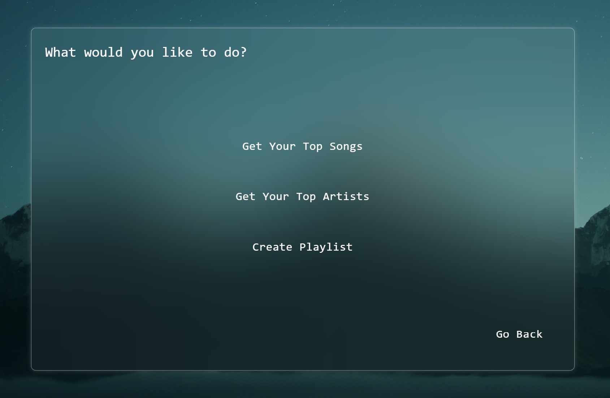
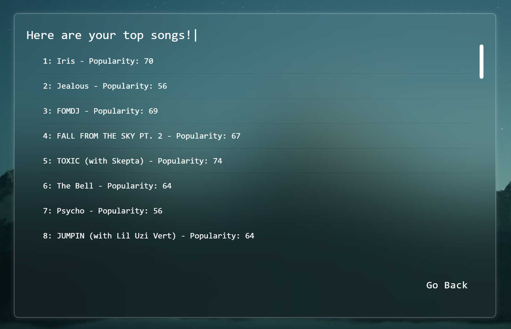
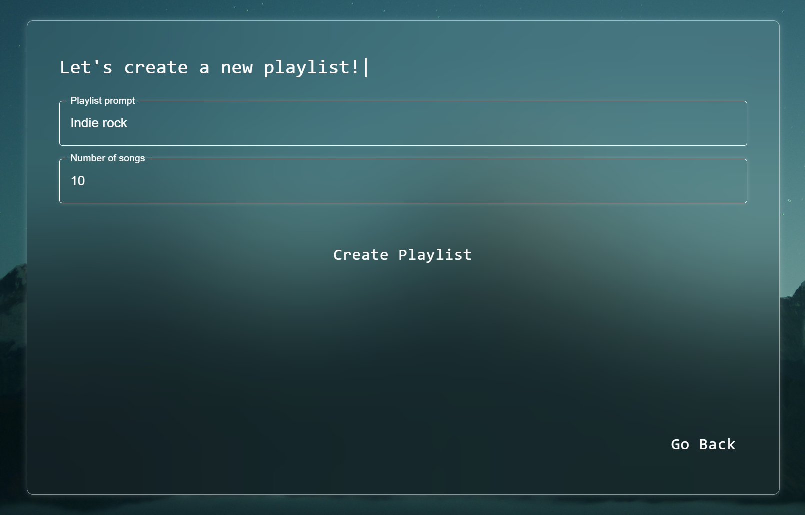
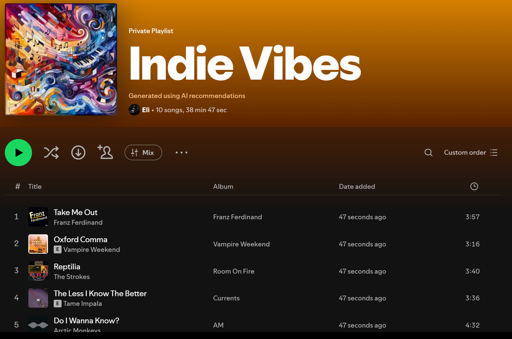

# Spoti-Tool
> *Create personalized Spotify playlists using AI*
> 
## [**▶️ Watch Video Demonstration Here**](https://github.com/EliA437/Spoti-Tool/blob/main/frontend/public/markdown.mp4?raw=true)

 **Current Version Notice**  
In the current version of Spoti-Tool, the Spotify login feature has been disabled.  
This is because without official approval from Spotify’s Developer team, OAuth access is limited and won’t work for public users.  
Until the app is accepted for extended quota mode, it runs without login functionality so you can still test other parts of the app.

A full-stack application that generates custom Spotify playlists based on your prompts using OpenAI's GPT and DALL-E. Users log in with their own Spotify accounts, describe the vibe they want, and the AI creates both the playlist and a custom cover image. Built with React (frontend) and FastAPI (backend).

## Features
- **Spotify OAuth Integration** - Users log in with their own Spotify accounts *(disabled in current version)*
- **AI-Powered Playlist Generation** - Describe any mood, genre, or theme and get a curated playlist
- **Custom AI-Generated Cover Art** - Each playlist gets a unique cover image created by DALL-E
- **Real-Time Status Updates** - Watch your playlist being created with live progress updates
- **Smart Track Matching** - AI suggestions are matched with actual Spotify tracks
- **View top tracks and artists** from your Spotify account
- **Terminal-style UI** with typing animations
- **Liquid glass style UI** with updateable background

