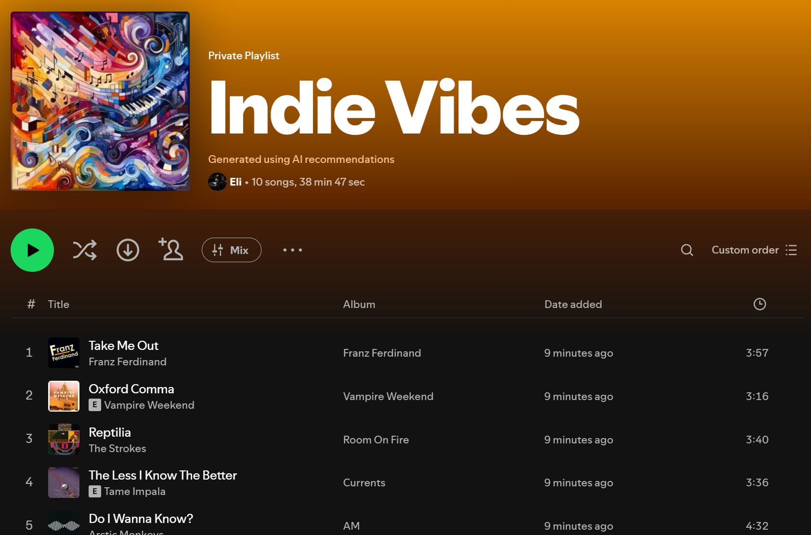

# AI Spotify Playlist Generator
> *Create personalized Spotify playlists using AI*

A full-stack application that generates custom Spotify playlists based on your prompts using OpenAI's GPT and DALL-E. Users log in with their own Spotify accounts, describe the vibe they want, and the AI creates both the playlist and a custom cover image. Built with React (frontend) and FastAPI (backend).

## Features

- **Spotify OAuth Integration** - Users log in with their own Spotify accounts
- **AI-Powered Playlist Generation** - Describe any mood, genre, or theme and get a curated playlist
- **Custom AI-Generated Cover Art** - Each playlist gets a unique cover image created by DALL-E
- **Real-Time Status Updates** - Watch your playlist being created with live progress updates
- **Smart Track Matching** - AI suggestions are matched with actual Spotify tracks
- **View top tracks and artists** from your Spotify account
- **Terminal-style UI** with typing animations
- **Liquid glass style UI** with updateable background




## Setup

### Frontend

1. Navigate to the frontend folder:
   ```bash
   cd frontend
   ```

2. Start the development server:
   ```bash
   npm run dev
   ```

3. Open your browser at **http://localhost:5173**

### Backend

1. Open a new terminal and navigate to the backend folder:
   ```bash
   cd backend
   ```

2. Create and activate a virtual environment:
   
   **Windows:**
   ```bash
   python -m venv venv
   .\venv\Scripts\activate
   ```
   
   **macOS/Linux:**
   ```bash
   python3 -m venv venv
   source venv/bin/activate
   ```

3. Install dependencies:
   ```bash
   pip install -r requirements.txt
   ```

4. Set up environment variables:
   Create a `.env` file in the backend directory:
   ```env
   SPOTIPY_CLIENT_ID=your_spotify_client_id
   SPOTIPY_CLIENT_SECRET=your_spotify_client_secret
   SPOTIPY_REDIRECT_URI=http://localhost:8000/api/auth/callback
   OPEN_AI_KEY=your_openai_api_key
   ```

5. Start the FastAPI server:
   ```bash
   uvicorn app:app --reload --port 8000
   ```

The backend API will be available at **http://localhost:8000**

## Notes

- You need a Spotify Developer Account and OpenAI API key
- Set up your Spotify app with redirect URI: `http://localhost:8000/api/auth/callback`
- Generated playlist images are stored in `backend/playlist_images/`
- Users must log in with their own Spotify account to create playlists

## Disclaimers

- **Playlist Image Generation** - Cover art creation sometimes encounters issues due to OpenAI's content restrictions. If image generation fails, the playlist will still be created without a custom cover.
- **Song Count** - The number of songs you enter is treated as a maximum. The app may not always find the exact number of tracks you requested, especially for very specific or niche prompts.
- **Early Development** - This is an early version of the application and is still under active development. Some features may not work perfectly or may change in future updates.
